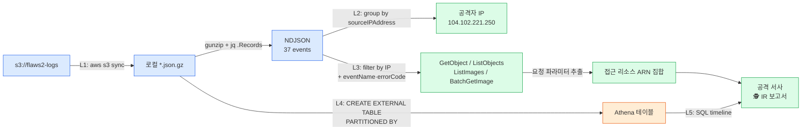

# flaws2.cloud — 서버리스 · 컨테이너 · IR

[flaws2.cloud](http://flaws2.cloud/) 는 flaws.cloud 의 후속작으로, **두 가지 트랙** 이 있다.

- **Attacker 트랙** (레벨 1~3) — 서버리스(Lambda, API Gateway)와 컨테이너(ECR, ECS Fargate) 환경의 오설정을 **공격자 시점** 에서 체험.
- **Defender 트랙** (레벨 1~5) — 위 공격이 남긴 **CloudTrail 로그** 를 가지고 침해사고 대응(IR) 을 수행. jq 로 초기 분석, Athena 로 타임라인 재구성.

## 🗺 트랙 개요

### Attacker
| # | 주제 | 서비스 | 난이도 |
|---|------|--------|--------|
| [Attacker Level 1](attacker/level-01.md) | Lambda 에러 응답에 노출된 env 변수 → 실행 역할 자격증명 | Lambda, API Gateway | ⭐⭐ |
| [Attacker Level 2](attacker/level-02.md) | 공개 ECR 레포지토리 이미지 히스토리에서 자격증명 추출 | ECR, Docker, IAM | ⭐⭐ |
| [Attacker Level 3](attacker/level-03.md) | 프록시 SSRF + `file://` + ECS Task Metadata | ECS Fargate, SSRF | ⭐⭐⭐ |

### 🔗 Attacker 트랙 — 서비스 호핑 흐름

한 역할이 다음 역할의 키를 내어주는 구조. 매 단계마다 **권한 경계**가 어떻게 무너지는지에 주목.

```mermaid
flowchart LR
    P[공격자 브라우저] -->|?code=a| L1[Lambda level1]
    L1 -.에러 응답에 env 덤프.-> C1["ASIA...<br/>role: level1"]
    C1 -->|s3 ListBucket<br/>level1.flaws2.cloud| S1[secret-ppxVFdw...html]
    S1 --> L2page[level2-...flaws2.cloud<br/>힌트: ECR 레포 level2]
    L2page -->|describe-images<br/>+ batch-get-image| ECR["ECR level2 이미지<br/>config blob .history"]
    ECR -.Dockerfile RUN.-> H["htpasswd<br/>flaws2:secret_password"]
    H -->|Basic Auth 통과| Proxy[container.target.flaws2.cloud<br/>proxy.py]
    Proxy -->|file:///proc/self/environ| E["AWS_CONTAINER_CREDENTIALS_<br/>RELATIVE_URI=/v2/credentials/&lt;uuid&gt;"]
    E -->|169.254.170.2$URI| C3["ASIA...<br/>role: level3 (Task Role)"]
    C3 -->|s3 ListBucket| End["the-end-...flaws2.cloud<br/>🏁 Congrats"]

    classDef cred fill:#ffe4b5,stroke:#d97706;
    classDef pwned fill:#fee2e2,stroke:#dc2626;
    classDef flag fill:#dcfce7,stroke:#16a34a;
    class C1,C3,E cred
    class H,S1 pwned
    class End flag
```

### Defender
| # | 주제 | 도구 | 난이도 |
|---|------|------|--------|
| [Defender Level 1](defender/level-01.md) | 공격자가 남긴 CloudTrail 로그 확보 | aws s3, gzip | ⭐ |
| [Defender Level 2](defender/level-02.md) | jq 로 공격자 IP·UA 식별 | jq | ⭐⭐ |
| [Defender Level 3](defender/level-03.md) | 악성 API 호출 패턴 추출 | jq | ⭐⭐ |
| [Defender Level 4](defender/level-04.md) | Athena 환경 구성 | Athena, DDL | ⭐⭐ |
| [Defender Level 5](defender/level-05.md) | 타임라인·영향 범위 최종 판정 | SQL, Athena | ⭐⭐⭐ |

### 🧪 Defender 트랙 — IR 파이프라인

같은 공격이 **로그에는 어떻게 남는가** 를 단계별로 해석해 최종 타임라인으로 조립.

## 🧭 학습 순서

Scott Piper 의 공식 권장 순서대로:
1. **Attacker 1~3** 을 먼저 깬다 — "공격자 관점" 이 체감된다.
2. 이어서 **Defender 1~5** — 바로 그 공격이 남긴 흔적을 따라간다. 앞에서 본인이 찍은 발자국이 로그에 어떻게 보이는지가 강력한 배움이 된다.

## 📎 flaws.cloud 와의 차이

- **무료 계정 필요성↑**: Defender Level 4~5 는 Athena 쿼리 실습이라 본인 계정에서 직접 돌리는 게 이상적(쿼리 비용은 몇 센트 수준).
- **로그/CloudTrail 중심**: IR 경험이 없다면 Defender 1~3 만 해도 "AWS 로그 리딩 감" 이 크게 는다.
- **리전**: flaws2 의 공격 대상 인프라는 대부분 **us-east-1** 에 있다. 리전 인자 주의.

## ⏭ 처음이라면

이 트랙을 시작하기 전 [AWS 보안 primer](../docs/aws-security-primer.md) 의 **Cognito (미포함)** · **Lambda** · **ECS Task Role** · **CloudTrail** 섹션을 먼저 훑고 오면 훨씬 수월하다.
